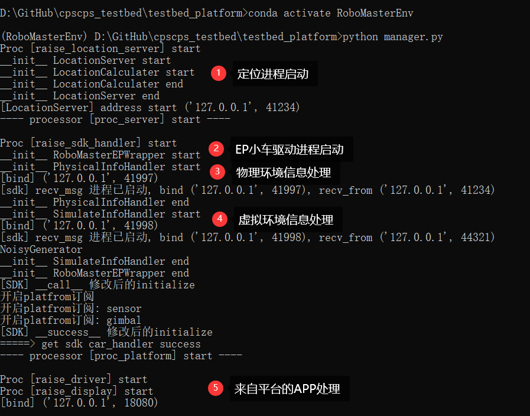

# 大疆机甲大师空间同步测试床

一个用于执行robomaster EP应用程序的综合运行环境，包括基于Unity 3D搭建的虚拟环境，和基于EP小车+方型场地搭建的物理环境。

应用程序在虚拟环境中感知，在物理环境中执行。

## 相关代码仓库

- Unity 3D 虚拟场景项目：[地址](https://plastichub.unity.cn/kili_1998/SimulatedScene)

- 上下文平台：TODO


## 运行步骤 - 独立用户进程

### 1 ）配置虚拟运行环境

- 配置迷宫地图

  - `.\Map\MapConfig.txt`文件

  

  如果需要更换为大迷宫图，将_Large.txt中的内容进替换。

  

- 运行项目：点击开始按钮。


该过程启动了一个虚拟环境端服务器，供：

- 外部向虚拟环境更新车辆位置

- 虚拟环境向外部提供场景数据（传感器数据、车辆状态）

  

### 2）启动测试床平台

- 测试床启动端：`cpscps_testbed\testbed_platform\manager.py`

- 启动方式：

  1. 在`cpscps_testbed\testbed_platform ` 目录创建cmd.exe终端

  2. 通过conda，启动带有robomaster库的python环境:

     ```
     conda activate RoboMasterEnv
     ```
  
  3. 运行`manager.py`, 启动除用户进程外的所有进程。
  
     ```
     python manager.py
     ```

- 启动完成效果：

  - 一个plt绘图窗口，显示物理环境中小车的定位：

    

  - cmd窗口内显示如下信息，最后一行的端口是用户APP的处理端口：

    ```
    Proc [raise_driver] start
    Proc [raise_display] start
    [bind] ('127.0.0.1', 18080)
    ```

    该模式下，用户APP是一个独立的python程序。

    // 在论文中，用户APP是一个内嵌的python函数。

### 3）启动用户程序

- 测试床启动端：`cpscps_testbed\user_app\app_example.py`

- 启动方式：

  1. 在`cpscps_testbed\user_app ` 目录创建cmd.exe终端

  2. 运行`app_example.py`, 启动用户程序。

     ```
     python app_example.py
     ```

- 启动完成效果：
